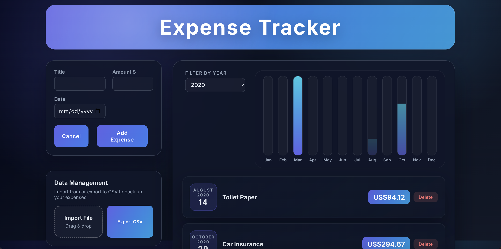

# Expense Tracker

Welcome to Expense Tracker, a modern single‑page React application for keeping a lightweight ledger of day‑to‑day expenses. It focuses on quick entry, flexible filtering, and keeping data portable so you can back up or migrate your records easily.

## Live Demo

- Vercel deployment: https://expense-tracker-se3200.vercel.app/

## Highlights



- **Local persistence:** All expenses are stored in the browser via `localStorage`, so entries survive refreshes or closing the tab.
- **Add & delete entries:** Capture a title, amount, and date with inline validation, then remove any record with a single click.
- **Dynamic filters & charts:** View expenses grouped by year, filter the list, and visualize monthly spend with the included bar chart.
- **CSV import/export:** Download your ledger as CSV for backup or import an existing file (comma or tab delimited) via drag-and-drop.
- **Responsive glass UI:** Redesigned dark theme with glassmorphism treatment across cards, forms, and the sidebar import controls.

## Architecture & Design Choices

- **Client-only architecture:** The app is a pure React SPA deployed to static hosting (e.g., Vercel). All persistence uses browser APIs, removing backend dependencies.
- **State management:** Expense state lives at the `App` level, feeding down to `DisplayExpenses`, `NewExpense`, and `DataControls` while being synced to `localStorage` via `useEffect`.
- **Component grouping:** Feature folders (`components/Expenses`, `components/NewExpense`, etc.) mirror UI modules, making it easy to locate related styles and logic.
- **CSV module:** `DataControls` encapsulates parsing/export logic, so future persistence mechanisms (REST, IndexedDB) can reuse a single entry point.
- **Design system:** Theme tokens live in `src/index.css` (`--bg`, `--primary`, etc.). Cards share the same glassmorphism styling (`components/UI/Card.css`) with variations layered via component-specific CSS.


## Getting Started

To run the application locally and explore its codebase, follow these steps:

1. Clone the repository:

```bash
git clone https://github.com/ReeveFernandes/Expense-Tracker.git
```

2. Navigate to the project directory:

```bash
cd Expense-Tracker
```

3. Install the dependencies:

```bash
npm install
```

4. Start the development server:

```bash
npm start
```

5. Open your browser and visit [http://localhost:3000](http://localhost:3000) to see the application in action.

## Technologies Used

- React 18 with Create React App
- Browser APIs (`localStorage`, `FileReader`, `Blob`) for persistence and CSV handling
- CSS Modules / plain CSS for component-scoped styling

## Acknowledgements

- Based on the original [Expense Tracker](https://github.com/ReeveFernandes/Expense-Tracker) by Reeve Fernandes and adapted for this coursework.

Enjoy tracking your expenses with Expense Tracker!
